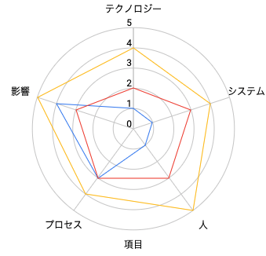

# はじめに

このフレームワークにより、ソフトウェアエンジニアリングマネージャーは、各ポジションの期待とキャリアラダーの次のレベルを計画する方法について、直属の部下と有意義な会話をすることができます。

フレームワークは、レーダーチャートに大きく依存して、特定の位置のさまざまな視点と期待を視覚的に示します。

# キャリアラダー

フレームワークには3つの異なるラダーがあります。

* [**開発者**](Developer.md)：プログラマーまたはソフトウェアエンジニアとも呼ばれる役割には、深いレベルの技術的専門知識が必要です
* [**テックリード**](TechLead.md)：開発リードとも呼ばれる役割は、システムの所有者であり、実践的な開発、アーキテクチャの知識、および本番サポートの間の独自のバランスが必要です。
* [**エンジニアリングマネージャー**](EngineeringManager.md)：開発マネージャーとも呼ばれる役割は、チームの一貫した提供、キャリアの成長、および幸福のレベルに責任があります

[テックリード](TechLead.md)と[エンジニアリングマネージャー](EngineeringManager.md)の違いについて混乱している場合は、[テックリード vs エンジニアリングマネージャー](TechLead-EngineeringManager.md)ページを参照してください。詳細な比較。

|レベル|シニア|[開発者](Developer.md)|[テックリード](TechLead.md)|[エンジニアリングマネージャー](EngineeringManager.md)|
|:---:|:---:|:---:|:---:|:---:|
|1|ジュニア|[D1](Developer.md#d1---開発者-1)|||
|2|ジュニア|[D2](Developer.md#d2---開発者-2)|||
|3|ジュニア|[D3](Developer.md#d3---開発者-3)|||
|4|シニア|[D4](Developer.md#d4---開発者-4)|[TL4](TechLead.md#tl4---テックリード-4)||
|5|シニア|[D5](Developer.md#d5---開発者-5)|[TL5](TechLead.md#tl5---テックリード-5)|[EM5](EngineeringManager.md#em5---エンジニアリングマネージャー-5)|
|6|シニア|[D6](Developer.md#d6---開発者-6)|[TL6](TechLead.md#tl6---テックリード-6)|[EM6](EngineeringManager.md#em6---エンジニアリングマネージャー-6)|
|7|シニア|[D7](Developer.md#d7---開発者-7)|[TL7](TechLead.md#tl7---テックリード-7)|[EM7](EngineeringManager.md#em7---エンジニアリングマネージャー-7)|

(詳細については、ポジション名をクリックしてください)

# 軸

上記のチャートには、次の5つの軸があります。
* **テクノロジー**：テクノロジースタックとツールに関する知識
* **システム**：システムの所有権のレベル
* **人**：チームとの関係
* **プロセス**：開発プロセスへの関与のレベル
* **影響**：ポジションの影響範囲

**影響**軸は直交しており、他のすべての軸に適用されるため、*異なる次元*と見なすことができます。

各軸には、5つの異なるレベルのパフォーマンスがあります。すべてのレベルに前のレベルが含まれていることを強調することが重要です。たとえば、テクノロジーを*伝道*し、*専門化*し、*採用*する人もいます。

各レベルをよりよく理解するために読み続けてください。

# レベル

## テクノロジー

1. **採用**：チームによって定義されたテクノロジーとツールを積極的に学習して採用します
2. **専門分野**：1つ以上のテクノロジーの頼りになる人物であり、新しいテクノロジーを学ぶために率先して行動します
3. **伝道**：調査し、概念実証を作成し、チームに新しいテクノロジーを導入します
4. **マスター**：システムのテクノロジースタック全体について非常に深い知識を持っています
5. **作成**：内部または外部のチームによって広く使用されている新しいテクノロジーを設計および作成します

## システム

1. **強化**：システムを改善および拡張するための新機能とバグ修正を正常にプッシュします
2. **設計**：システムの技術的負債を削減しながら、中規模から大規模の機能を設計および実装します
3. **所有者**：システムの本番運用と監視について理解し、改善することができます
4. **進化**：アーキテクチャを進化させます
5. **リード**：システムの優れた技術をリードし、停止を軽減するための計画を作成します

## 人

1. **学習**：他の人からすばやく学習し、必要に応じて一貫してステップアップします
2. **サポート**：他のチームメンバーを積極的にサポートし、チームメンバーの成功を支援します
3. **メンター**：他の人にキャリアの成長を加速するようにメンターし、参加を促します
4. **調整**：効果的なフィードバックを提供し、ディスカッションをモデレートするチームメンバーを調整します
5. **管理**：チームメンバーのキャリア、期待、パフォーマンス、幸福のレベルを管理します

## プロセス

1. **フォロー**：チームプロセスに従い、本番環境まで機能をリリースします
2. **実施**：チームプロセスを実施し、メリットとトレードオフを理解しています
3. **課題**：チームプロセスに挑戦し、それらを改善する方法を探します
4. **調整**：チームプロセスを調整し、フィードバックを聞き、変更を通じてチームを導きます
5. **定義**：チームの成熟度レベルに適したプロセスを定義し、敏捷性と規律のバランスを取ります

## 影響

1. **サブシステム**：1つ以上のサブシステムに影響を与えます
2. **チーム**：チームの特定の部分だけでなく、チーム全体に影響を与えます
3. **複数のチーム**：自分のチームだけでなく他のチームにも影響を与えます
4. **会社**：技術組織全体に影響を与えます
5. **コミュニティ**：技術コミュニティに影響を与えます

# FAQ

**一部の人がすべてのポイントを満たしていない場合はどうなりますか？**

それはごく普通のことで、人々は通常、ある地域では強く、他の地域では弱いです。このフレームワークは、人々を宣伝するためのチェックリストとしてではなく、有意義なキャリア会話を行うためのガイダンスとして使用する必要があります。

**直属の部下との話し合いを裏付ける証拠を収集するにはどうすればよいですか？**

さまざまなチームがさまざまな方法で証拠を収集します。推奨されるアプローチは、次の組み合わせを使用することです。
* 1：1の会話
* 同僚や他のチームからのフィードバック
* 自己評価

# その他のページ

* [**開発者**](Developer.md)
* [**テックリード**](TechLead.md)
* [**エンジニアリングマネージャー**](EngineeringManager.md)
* [**テックリード vs エンジニアリングマネージャー**](TechLead-EngineeringManager.md)
* [**マネージャーの管理**](Managing-Managers.md)
